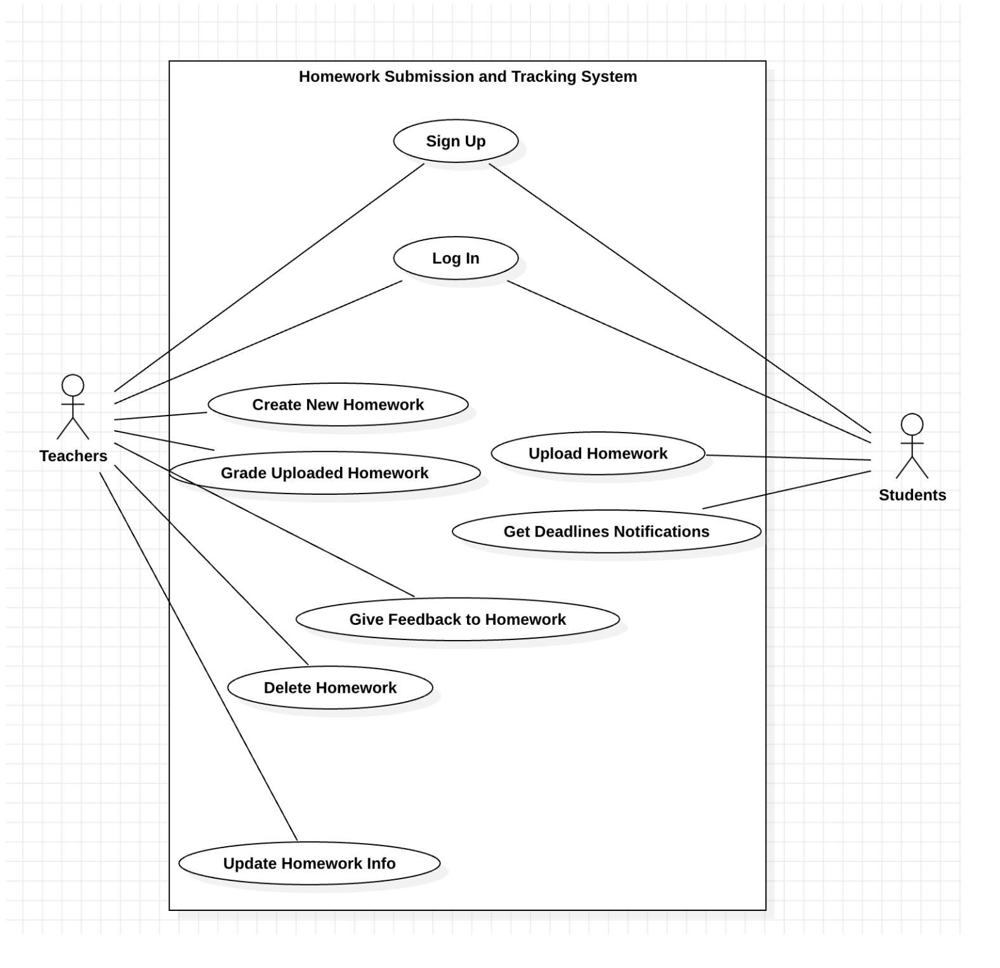
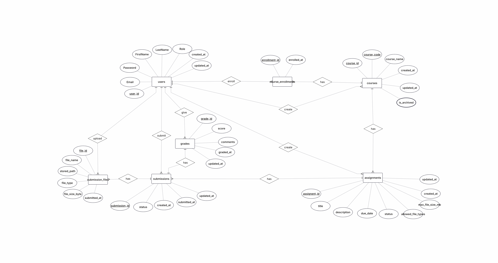
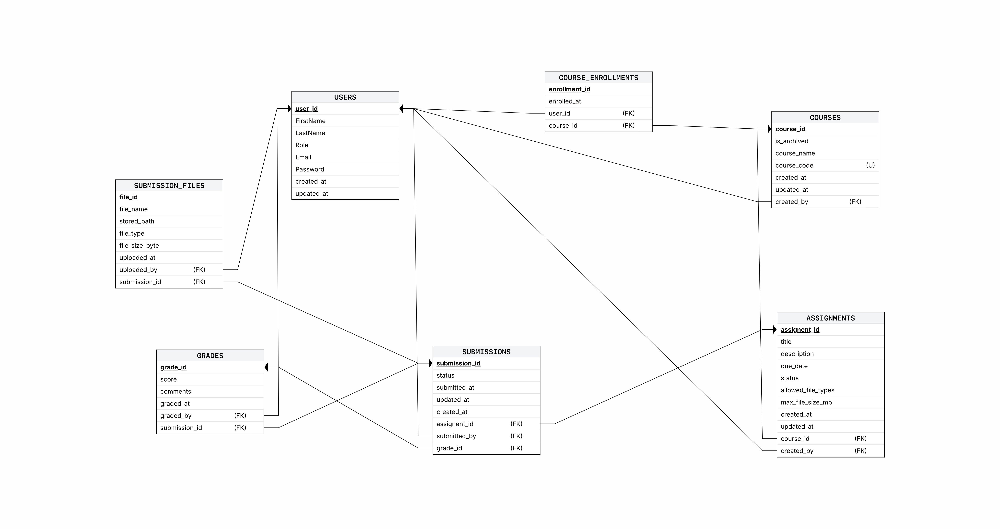
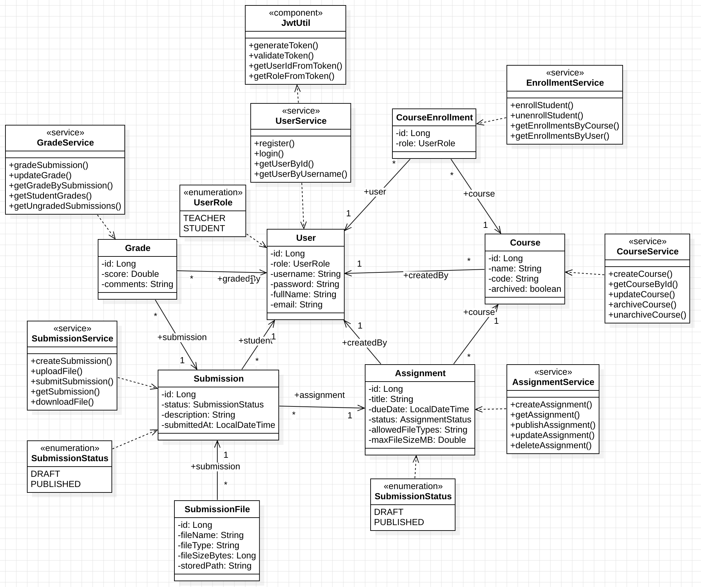

# Homework Submission System

This repository contains the Homework Submission System. The project backend is implemented with Java Spring Boot and the desktop frontend uses Electron. The system supports student assignment submissions, instructor assignment and grading workflows, and administrative user/course management.

## Database Design

Use case diagram:

ER diagram:

Relational schema:

UML class diagram (Back-end):

## Related Links
- [Link to the Trello boards](https://trello.com/w/sep1_group5/home)
- [Link to the Backend repo](https://github.com/RZ-Metropolia/assignment_submission_system_be)
- [Link to the Frontend repo](https://github.com/RyougiLee/SEP1_Sprint3_FE)
- [Link to the Backend docker image](https://hub.docker.com/repository/docker/ruiz890/assignment-submission-system-be/general)
