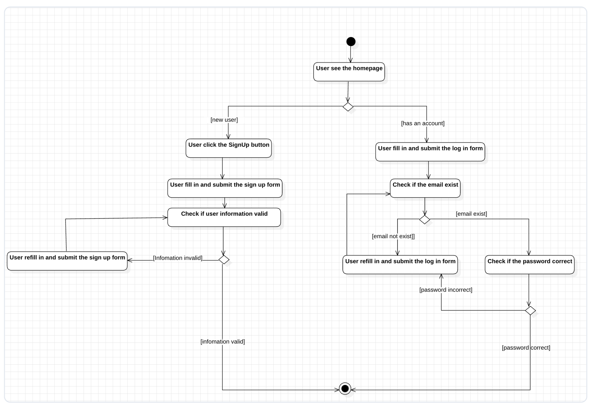

# Homework Submission System

This repository contains the Homework Submission System. The project backend is implemented with Java Spring Boot and the desktop frontend uses Electron. The system supports student assignment submissions, instructor assignment and grading workflows, and administrative user/course management.

## Diagrams

Use case diagram:

ER diagram:

Relational schema:

UML class diagram (Back-end):

User Sign-up & Log-in Activity Diagram:

## Localization Support

The system now features full internationalization (i18n) for the desktop interface to support a global user base.

### Supported Languages
- English (US) — `en-US`
- Simplified Chinese (简体中文) — `zh-CN`
- Japanese (日本語) — `ja-JP`

### How to Select a Language
There are two primary ways to switch the application language:

1.  **Entry Panel (Login/Signup)**: Locate the **Language Switcher** icon at the bottom-right corner of the authentication screen.
2.  **In-App Settings**:
    - Launch the app and log in.
    - Open the **Sidebar Navigation Panel**.
    - Go to **Settings**.
    - Under the **Appearance** section, locate the **Language Switcher** (represented by the **horizontal sliders icon**).

Changes in both locatons are triggered via a dropdown menu and take effect immediately across all dashboard views, tables, and buttons.

### Setup for Developers
The localization framework is built using `react-i18next`. For detailed developer instructions, translation namespaces, and contribution guidelines, please refer to the **[Frontend Repository README](https://github.com/MTP2024SE-GROUP5/assignment_submission_system_fe)**.

## Related Links
- [Link to the Trello boards](https://trello.com/w/sep1_group5/home)
- [Link to the Backend repo](https://github.com/RZ-Metropolia/assignment_submission_system_be)
- [Link to the Frontend repo](https://github.com/MTP2024SE-GROUP5/assignment_submission_system_fe)
- [Link to the Backend docker image](https://hub.docker.com/repository/docker/ruiz890/assignment-submission-system-be/general)
