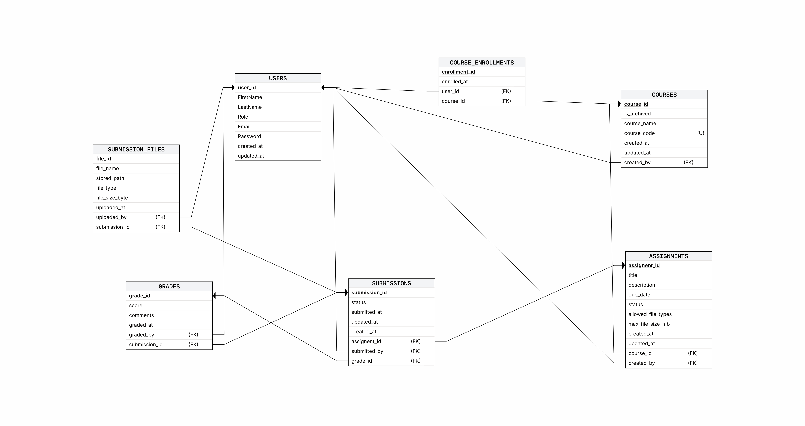
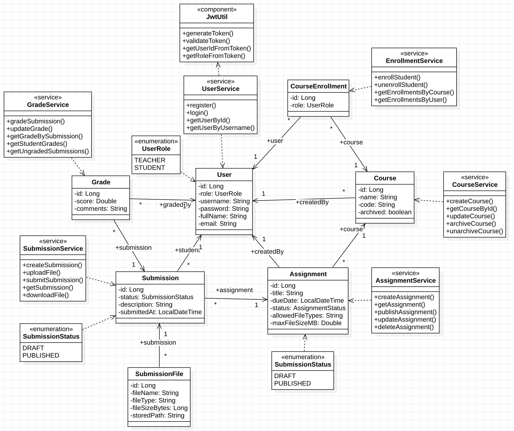

# Homework Submission System

## 1. Project Title & Overview

Homework Submission System is a desktop-based system for managing assignments, submissions, grading, and feedback. It solves the problems of paper and email-based homework handling. The target users are students and teachers. The main technologies are **Electron, React, TypeScript, Java Spring Boot, MariaDB, Docker, Jenkins, SonarQube**, and localization tools. The project was developed over **8 sprints x 2 weeks**.

### Key Diagrams

Relational schema:


UML class diagram:


## 2. Product Vision

**Vision statement:** create a simple and paperless system for assignment submission and grading.

### Main Goals

- support students and teachers
- manage assignments and submissions
- provide grading and feedback
- support multiple languages

### Key Features

- login and registration
- course and workspace management
- assignment creation and publishing
- draft and final submission
- grading and feedback
- language switching

### Definition of Success

The project is successful when users can log in, manage assignments, submit work, receive grades, and use the system in multiple languages.

## 3. Project Plan & Sprint Structure

The project followed **Agile / Scrum** with **2-week sprints**. Main project documents:

- [Project Plan](Documents/project_plan.md)
- [Product Vision](Documents/project_vision.md)
- [Backlog](Documents/backlog.md)

Sprint review reports:

- [Sprint 1 Review Report](Documents/sprint_1_review_report.md)
- [Sprint 2 Review Report](Documents/sprint_2_review_report.md)
- [Sprint 3 Review Report](Documents/sprint_3_review_report.md)
- [Sprint 4 Review Report](Documents/sprint_4_review_report.md)
- [Sprint 5 Review Report](Documents/sprint_5_review_report.md)
- [Sprint 7 Review Report](Documents/sprint_7_review_report.md)

## 4. Sprint 1 – Project Planning & Vision

- product vision created
- project plan created
- backlog created
- GitHub and Trello prepared
- links: [Project Plan](Documents/project_plan.md), [Product Vision](Documents/project_vision.md), [Backlog](Documents/backlog.md), [Sprint 1 Review Report](Documents/sprint_1_review_report.md)

## 5. Sprint 2 – Requirements & Database

- functional requirements refined
- use case and ER diagrams created
- MariaDB schema implemented
- CRUD test script prepared
- links: [Use Case Diagram](Documents/Diagrams/use_case_diagram.png), [ER Diagram](Documents/Diagrams/er_diagram.png), [Database Script](Documents/Database/db_generate.sql), [CRUD Test](Documents/Database/crud_test.sql), [Sprint 2 Review Report](Documents/sprint_2_review_report.md)

## 6. Sprint 3 – UI Implementation & CI

- UI implementation continued
- frontend and backend integration improved
- Jenkins CI added
- automated testing and coverage improved
- links: [Frontend Repository](https://github.com/MTP2024SE-GROUP5/assignment_submission_system_fe), [Sprint 3 Review Report](Documents/sprint_3_review_report.md)

## 7. Sprint 4 – Docker Containerization

- prototype finalized
- backend containerized with Docker
- Docker image published
- links: [Backend Docker Image](https://hub.docker.com/repository/docker/ruiz890/assignment-submission-system-be/general), [Sprint 4 Review Report](Documents/sprint_4_review_report.md)

## 8. Sprint 5 – UI Localization & Kubernetes

- UI localization implemented
- supported languages:
  - `en-US`
  - `zh-CN`
  - `ja-JP`
  - `ar-AE`
  - `fa-IR`
- localization approach: `react-i18next` with JSON locale files
- Kubernetes usage: planned only, not documented in this repository
- links: [Frontend README](https://github.com/MTP2024SE-GROUP5/assignment_submission_system_fe/blob/master/README.md), [Locales](https://github.com/MTP2024SE-GROUP5/assignment_submission_system_fe/blob/master/src/locales/index.ts), [Sprint 5 Review Report](Documents/sprint_5_review_report.md)

## 9. Sprint 6 – Database Localization

- localization support extended to architecture and data design
- localization diagrams updated
- acceptance testing prepared
- links: [Localization ER Diagram](Documents/Diagrams/localization_er.png), [Localization UML Diagram](Documents/Diagrams/localization_uml.png), [Acceptance Test Plan](Documents/Testing/test_ceases.md)

## 10. Sprint 7 – Quality Assurance

- SonarQube review completed
- heuristic evaluation completed
- UAT completed
- links: [SonarQube Evidence](Documents/Testing/sonnar-qube-report.png), [Heuristic Evaluation](Documents/Testing/heuristic_evaluation_summary_report.pdf), [UAT Report](Documents/Testing/use_accepting_test_report.md), [Acceptance Test Plan](Documents/Testing/test_ceases.md), [Sprint 7 Review Report](Documents/sprint_7_review_report.md)

## 11. Sprint 8 – Documentation & Finalization

- README finalized
- architecture, testing, and database links organized
- links: [Package Diagram](Documents/Diagrams/package-diagram.png), [UML Class Diagram](Documents/Diagrams/uml_class_diagram.png), [Relational Schema](Documents/Diagrams/relational_schema.png)

## 12. How to Run the Project

This repository is the documentation repository. The runnable project is in the linked repositories.

### Prerequisites

- Node.js and npm
- running backend API

### Links

- frontend: [assignment_submission_system_fe](https://github.com/MTP2024SE-GROUP5/assignment_submission_system_fe)
- backend: [assignment_submission_system_be](https://github.com/RZ-Metropolia/assignment_submission_system_be)
- docker image: [Backend Docker Image](https://hub.docker.com/repository/docker/ruiz890/assignment-submission-system-be/general)
- trello board: [Project Trello Board](https://trello.com/w/sep1_group5)
### Frontend Setup

```bash
npm install
npm start
```

### Access

- cloud API default: `https://164.92.241.92:8080/api`
- local API default: `http://localhost:8081/api`

## 13. Testing Instructions

### Frontend

```bash
npm test
npm run test:ui
npm run test:coverage
```

### Evidence

- [Frontend package.json](https://github.com/MTP2024SE-GROUP5/assignment_submission_system_fe/blob/master/package.json)
- [Database Script](Documents/Database/db_generate.sql)
- [CRUD Test](Documents/Database/crud_test.sql)
- [SonarQube Evidence](Documents/Testing/sonnar-qube-report.png)
- [Acceptance Test Plan](Documents/Testing/test_ceases.md)
- [UAT Report](Documents/Testing/use_accepting_test_report.md)

## 14. Repository Structure

- `/README.md`
- `/Documents/project_vision.md`
- `/Documents/project_plan.md`
- `/Documents/backlog.md`
- `/Documents/sprint_*`
- `/Documents/Diagrams`
- `/Documents/Database`
- `/Documents/Testing`

## 15. Authors

| Team Member | Role |
|---|---|
| Chun He | Developer and Tester |
| Juyin Tang | Developer and Tester |
| Zongru Li | Frontend Developer |
| Rui Zhao | Backend Developer |

Course: **Software Engineering Project 2**  
Semester: **Spring 2026**
